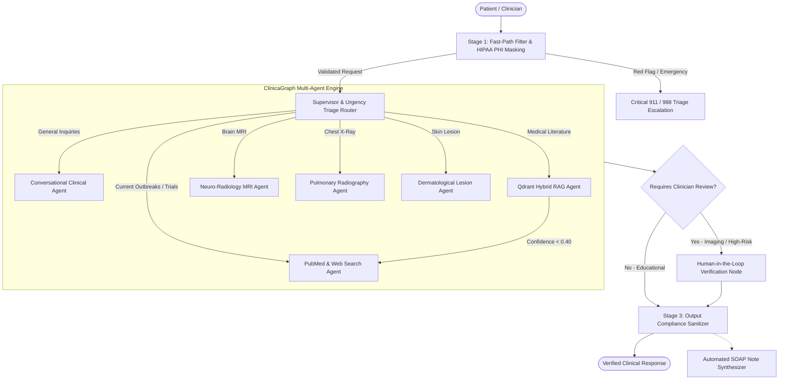

<div align="center">

# ⚕️ ClinicaGraph AI
### Autonomous Multi-Agent Clinical Triage System

[](https://www.python.org/)
[](https://langchain-ai.github.io/langgraph/)
[](https://fastapi.tiangolo.com/)
[](https://qdrant.tech/)
[](https://pytorch.org/)
[](https://www.docker.com/)

<p align="center">
  <strong>An enterprise-grade, multimodal clinical decision support platform orchestrated with LangGraph, featuring real-time urgency triage, hybrid vector retrieval, deep learning radiological segmentation, human-in-the-loop verification, and automated EMR-ready SOAP note synthesis.</strong>
</p>

</div>

---

## 🌟 Key Innovations

- **Autonomous Clinical Urgency Stratification**: Triage engine categorizes every interaction into `CRITICAL`, `URGENT`, `ROUTINE`, or `INFORMATIONAL` urgency tiers, automatically initiating immediate escalation protocols for emergency presentations.
- **Provider-Agnostic LLM Engine**: Seamlessly switches between Direct OpenAI (`gpt-4o`), Azure OpenAI enterprise deployments, and deterministic offline mock simulation for demonstration and evaluation.
- **Multimodal Radiographic Diagnostics**:
  - **Brain MRI**: Intracranial focal hyperintensity localization and contour segmentation.
  - **Chest Radiography (CXR)**: Deep CNN classification for COVID-19 / viral pulmonary opacities vs. clear lung parenchyma.
  - **Dermatological Imaging**: Morphological U-Net segmentation and ABCD dermoscopic lesion boundary mapping.
- **Hybrid Medical RAG with Cross-Encoder Reranking**: Combines dense vector retrieval in Qdrant with `ms-marco-TinyBERT-L-6` cross-encoder reranking. Automatically falls back to real-time PubMed and Tavily web research if internal retrieval confidence drops below threshold.
- **Automated Clinical SOAP Note Generation**: One-click synthesis of consultation dialogues into structured Subjective, Objective, Assessment, and Plan (SOAP) clinical documentation with ICD-10 suggestions.
- **Clinician Human-in-the-Loop (HITL)**: Mandatory interactive validation checkpoints before automated radiological inferences are verified.
- **Multi-Tiered Safety Guardrails**: Fast-path sub-millisecond regex filters for emergency red flags, HIPAA PII/PHI de-identification masking, and prompt injection defense.

---

## 🏛️ System Architecture



---

## 📂 Project Structure

```
ClinicaGraph-AI/
├── core/
│   ├── __init__.py
│   └── llm_provider.py             # Multi-provider LLM & Embeddings abstraction
├── agents/
│   ├── agent_decision.py           # LangGraph supervisor, state graph, and triage logic
│   ├── guardrails/
│   │   └── local_guardrails.py     # Fast-path triage, HIPAA anonymizer, semantic safety
│   ├── image_analysis_agent/
│   │   ├── brain_tumor_agent/      # MRI segmentation and anatomical localization
│   │   ├── chest_xray_agent/       # COVID-19/pneumonia deep learning classification
│   │   ├── skin_lesion_agent/      # U-Net dermoscopic lesion segmentation
│   │   └── image_classifier.py     # Multimodal visual router
│   ├── rag_agent/                  # Document parsing, Qdrant vectors, TinyBERT reranking
│   └── web_search_processor_agent/ # PubMed & Tavily real-time literature search
├── templates/
│   └── index.html                  # Responsive clinical web dashboard
├── data/                           # Ingested medical knowledge base & Qdrant database
├── uploads/                        # Temporary diagnostic imaging and speech outputs
├── config.py                       # Unified system configuration
├── app.py                          # FastAPI production server
├── ingest_rag_data.py              # CLI document ingestion pipeline
├── Dockerfile                      # Production container image specification
└── requirements.txt                # Python dependencies
```

---

## ⚡ Quickstart & Installation

### Prerequisites
- Python 3.11+
- FFmpeg (for voice dictation processing)

### 1. Clone & Set Up Environment

```bash
# Clone the repository
git clone https://github.com/your-username/ClinicaGraph-AI.git
cd ClinicaGraph-AI

# Create virtual environment
python -m venv venv
source venv/bin/activate  # On Windows: venv\Scripts\activate

# Install dependencies
pip install -r requirements.txt
```

### 2. Configure Environment Variables
Create a `.env` file in the project root:

```env
# Provider Selection: 'openai', 'azure', or 'mock' (offline demo mode)
LLM_PROVIDER=openai
OPENAI_API_KEY=your_openai_api_key_here
OPENAI_MODEL=gpt-4o

# Optional: Real-time search & speech
TAVILY_API_KEY=your_tavily_api_key_here
ELEVEN_LABS_API_KEY=your_elevenlabs_key_here

# Server Settings
PORT=8000
DEBUG=true
```

> **Tip**: If no API keys are configured, ClinicaGraph AI automatically operates in resilient **Offline Demonstration Mode** using intelligent deterministic fallbacks.

### 3. Run the Server

```bash
python app.py
```
Access the clinical dashboard at **`http://localhost:8000`**.

---

## 🐳 Docker Deployment

Run ClinicaGraph AI inside a self-contained container:

```bash
# Build the Docker image
docker build -t clinicagraph-ai:latest .

# Run container on port 8000
docker run -p 8000:8000 --env-file .env clinicagraph-ai:latest
```

---

## 🔌 API Endpoints

| Endpoint | Method | Description |
| :--- | :--- | :--- |
| `/chat` | `POST` | Process clinical dialogue through the multi-agent state graph with session memory. |
| `/upload` | `POST` | Multimodal diagnostic upload (Brain MRI, Chest X-Ray, Dermoscopy) with segmentation. |
| `/validate` | `POST` | Clinician Human-in-the-Loop review submission (Confirm / Flag for Review). |
| `/api/soap-note` | `POST` | Synthesizes a structured clinical SOAP note from active session transcript. |
| `/api/system-status` | `GET` | Returns active runtime provider, vector database telemetry, and agent states. |
| `/health` | `GET` | Container health probe. |

---

## 🛡️ Medical AI Disclaimer
ClinicaGraph AI is developed for **educational, research, and clinical decision support purposes only**. It does not constitute a formal medical diagnosis or prescribing tool. Diagnostic outputs should always be reviewed and corroborated by a licensed healthcare professional.

---

## 📄 License
This project is licensed under the Apache 2.0 License.
