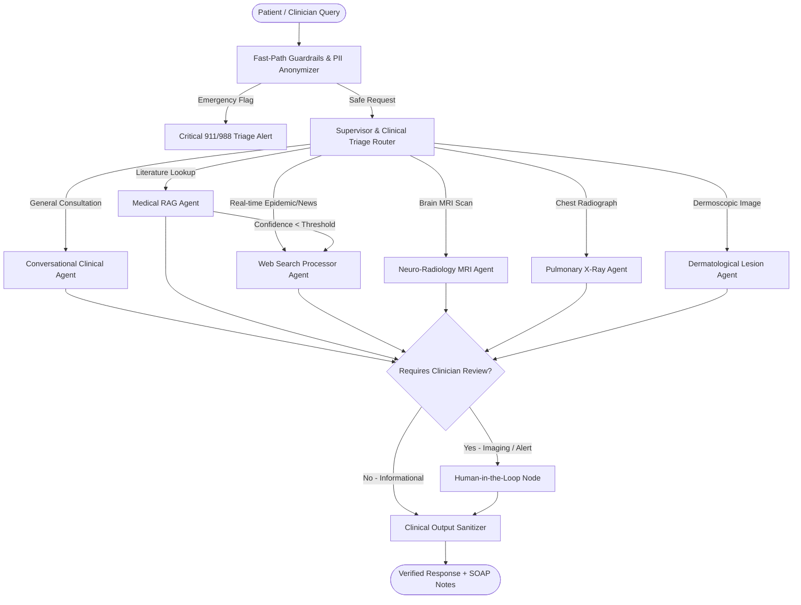

# ClinicaGraph AI: Multi-Agent Clinical Architecture

This document outlines the design patterns, decision flow, state machine, and specialized agents powering the **ClinicaGraph AI** clinical triage and decision system.

---

## 1. Supervisor & Clinical Triage Router
- **Framework**: Built with `LangGraph` using a stateful `StateGraph(AgentState)` compiled with checkpointed session memory.
- **Triage Classification**: Evaluates every user query across 4 distinct clinical urgency categories:
  - `CRITICAL`: Life-threatening conditions (acute myocardial infarction, stroke indicators, severe dyspnea, acute psychiatric distress). Fast-path emergency escalation is triggered immediately.
  - `URGENT`: High fever with severe systemic symptoms, rapidly progressing infections, severe acute pain.
  - `ROUTINE`: Chronic symptom management, medication guidance, standard diagnostic inquiries.
  - `INFORMATIONAL`: General anatomical questions, physiological explanations, literature queries.
- **Dynamic Handoff**: Inspects multimodal attachments, detected image modality, and recent dialogue context to pick the optimal agent.

---

## 2. Evidence-Based Clinical RAG Agent
- **Vector Database**: Qdrant (local embedded or enterprise cloud cluster).
- **Retrieval Pipeline**:
  1. **Query Expansion**: Clinical synonym mapping and anatomical normalization.
  2. **Dense Vector Search**: 1536-dimensional cosine similarity embeddings.
  3. **Cross-Encoder Reranker**: Employs `cross-encoder/ms-marco-TinyBERT-L-6` to rerank the top candidate chunks, ensuring high semantic relevance.
  4. **Dynamic Fallback**: If vector retrieval confidence drops below `min_retrieval_confidence` (default 0.40) or context is insufficient, execution transitions automatically to the **Web Search Processor Agent**.

---

## 3. Real-Time PubMed & Web Search Processor Agent
- **Target**: Time-sensitive clinical guidelines, recent outbreak metrics, FDA drug updates, and novel clinical trials.
- **Orchestration**: Combines PubMed search queries and Tavily API search with multi-document LLM summarization, extracting peer-reviewed citations and clinical abstracts.

---

## 4. Multimodal Diagnostic Vision Agents
1. **Neuro-Radiology MRI Agent (`BrainTumorAgent`)**:
   - Accepts axial/coronal brain MRI scans.
   - Evaluates intracranial hyperintensities and focal lesions using bilateral morphological filtering and deep feature localization.
   - Outputs anatomical quadrant (e.g., Right Hemisphere Superior/Parietal) and generates visual overlay segmentation maps saved to `./uploads/brain_tumor_output/`.
2. **Pulmonary Radiography Agent (`ChestXRayClassification`)**:
   - Deep CNN classifier evaluating digital chest radiographs for COVID-19 viral pneumonia versus normal lung parenchyma.
3. **Dermatological Lesion Agent (`SkinLesionSegmentation`)**:
   - Implements U-Net encoder-decoder architecture with adaptive LAB color-space contour fallback for dermoscopic lesion boundary extraction.

---

## 5. Clinical Human-in-the-Loop (HITL) Validation
- Healthcare AI requires clinician verification before diagnoses are enacted.
- When any diagnostic imaging agent or critical clinical triage is triggered, the `needs_human_validation` flag halts automatic finalization.
- The UI presents clinicians with interactive verification controls (**Confirm Inference** / **Flag for Review**), creating an auditable review record.

---

## 6. Automated Clinical SOAP Note Synthesizer
- Generates structured **SOAP (Subjective, Objective, Assessment, Plan)** notes on demand from any active dialogue transcript.
- Standardizes patient encounters into EMR-ready documentation with differential diagnoses and ICD-10 suggestions.

---

## 7. Multi-Tiered Safety Guardrails
- **Stage 1 (Fast-Path Deterministic)**: Regex matching for sub-millisecond emergency red flags and adversarial jailbreak prevention.
- **Stage 2 (HIPAA De-Identification)**: Automatically scrubs Personally Identifiable Information (SSN, phone numbers, emails) before LLM ingestion.
- **Stage 3 (Semantic Output Sanitization)**: Appends non-prescriptive disclaimers and verifies that high-risk advice adheres to clinical communication standards.
